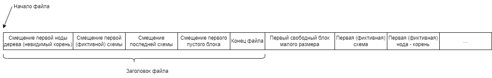
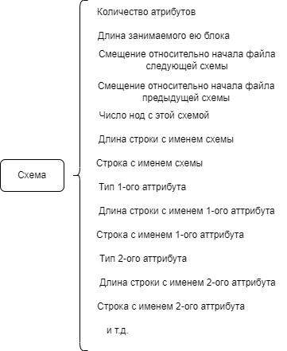
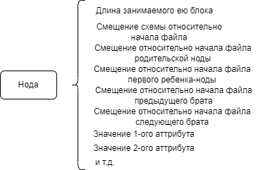
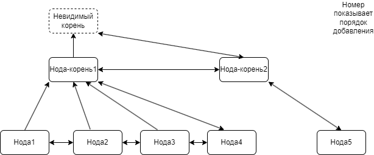
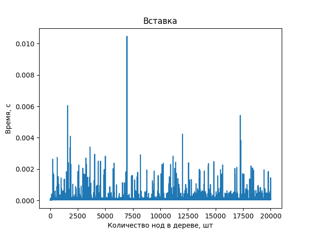
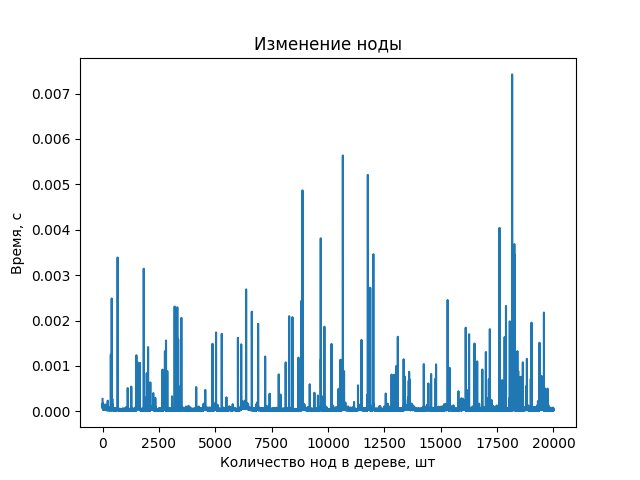
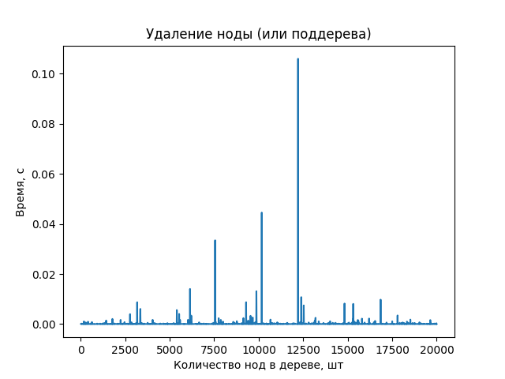
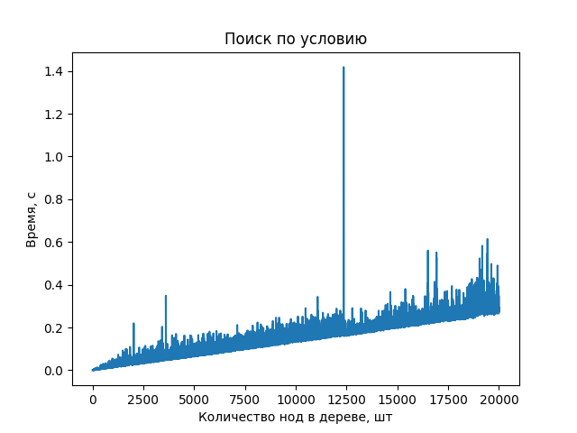
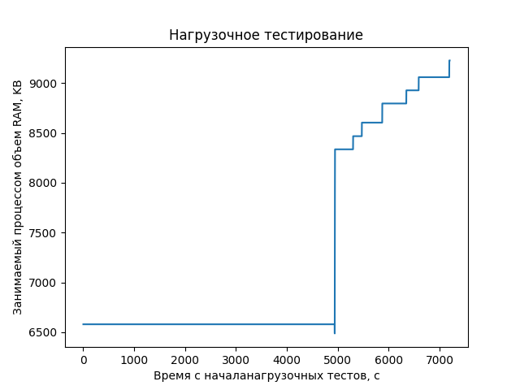
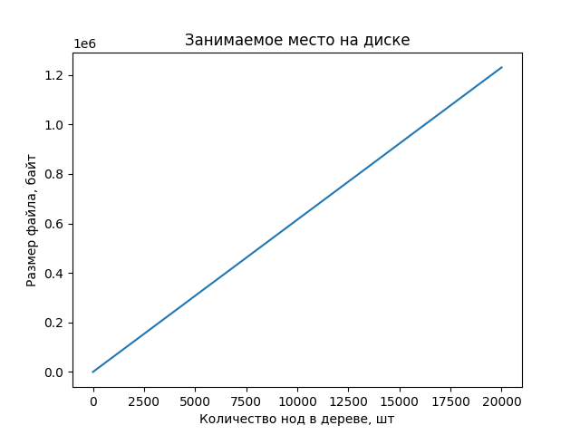

 # Лабораторная работа №1
 
## Цель
Модуль осуществляющий хранение (выборку, размещение, гранулярное обновление) данных в одном файле в форме документного дерева.
## Задачи
1. Спроектировать структуры данных для представления информации в оперативной памяти
   1. Для порции данных, состоящий из элементов определённого рода (см форму данных),
   поддержать тривиальные значения по меньшей мере следующих типов: цетырёхбайтовые
   целые числа и числа с плавающей точкой, текстовые строки произвольной длины, булевские
   значения
   1. Для информации о запросе
1. Спроектировать представление данных с учетом схемы для файла данных и реализовать базовые
   операции для работы с ним:
   1. Операции над схемой данных (создание и удаление элементов схемы)
   2. Базовые операции над элементами данных в соответствии с текущим состоянием схемы (над
   узлами или записями заданного вида)
      1. Вставка элемента данных
      1. Перечисление элементов данных
      1. Обновление элемента данных
      1. Удаление элемента данных
1. Используя в сигнатурах только структуры данных из п.1, реализовать публичный интерфейс со
   следующими операциями над файлом данных:
   1. Добавление, удаление и получение информации о элементах схемы данных, размещаемых в
   файле данных, на уровне, соответствующем виду узлов или записей
   1. Добавление нового элемента данных определённого вида
   1. Выборка набора элементов данных с учётом заданных условий и отношений со смежными
   элементами данных (по свойствам/полями/атрибутам и логическим связям соответственно)
   1. Обновление элементов данных, соответствующих заданным условиям
   1. Удаление элементов данных, соответствующих заданным условиям
4. Реализовать тестовую программу для демонстрации работоспособности решения
   1. Параметры для всех операций задаются посредством формирования соответствующих структур
   данных
   1. Показать, что при выполнении операций, результат выполнения которых не отражает
   отношения между элементами данных, потребление оперативной памяти стремится к O(1)
   независимо от общего объёма фактического затрагиваемых данных
   1. Показать, что операция вставки выполняется за O(1) независимо от размера данных,
   представленных в файле
   1. Показать, что операция выборки без учёта отношений (но с опциональными условиями)
   выполняется за O(n), где n – количество представленных элементов данных выбираемого вида
   1. Показать, что операции обновления и удаления элемента данных выполняются не более чем за
   O(n*m) > t  O(n+m), где n – количество представленных элементов данных обрабатываемого
   вида, m – количество фактически затронутых элементов данных
   1. Показать, что размер файла данных всегда пропорционален количеству фактически
   размещённых элементов данных
   1. Показать работоспособность решения под управлением ОС семейств Windows и *NIX
## Использование
### Windows
Требования:
* CMake 3.22.1+
* MinGW for x86_64 12.2.0+ (включая x86_64-w64-mingw32-gcc, x86_64-w64-mingw32-g++, ar, mingw32-make)

Установка системных переменных:
* PATH ({your_path} через обратный слэш):
  * {your_path}\CMakein
  * {your_path}\mingw64\bin
* MINGW_W64_BIN_DIR ({your_path} через прямой слэш):
   * {your_path}/mingw64/bin 

Сборка:

`build.bat`

Запуск unit-тестов:

`build\main.exe u`

Запуск нагрузочных тестов:

`build\main.exe s`
### Linux
Требования:
* CMake 3.22.1+
* GNU Make 4.3+
* g++ 11.3.0+

Сборка:

`./build.sh`

Запуск unit-тестов:

`./build/main u`

Запуск нагрузочных тестов:

`./build/main s`
## Устройство модуля

### File

Самый низкий уровень - содержит в себе функции для непосредственной записи в файл (чтении из файла) буферов указанной длины:

```
size_t write_buffer_to_file(int32_t fd, size_t offset, const void* buffer, size_t elem_size, size_t count)
size_t read_buffer_from_file(int32_t fd, size_t offset, void* buffer, size_t elem_size, size_t count)
```

Или же нуль-терминированных (в оперативной памяти, а в файле записанных как длина строки + она сама) строк:

```
size_t write_null_term_str_to_file(int32_t fd, size_t offset, const char* str)
size_t read_null_term_str_from_file(int32_t fd, size_t offset, const char** buffer)
```

Также в нем имеются функции открытия/закрытия файла, получения его размера и копирования строки в кучу и возвращения ссылки на неё в переданный указатель. Она не совсем относится к работе с файлом, но  используется во всех блоках более высоких уровней, поэтому лежит здесь.

```
int32_t open_file(const char* filename)
void close_file(int32_t fd)
size_t get_file_len(const int32_t fd)
void copy_str_to_heap(const char** dest, char* source)
```

### Structs

Содержит в себе описания используемых в модуле структур, а также функции по их записи в файл (чтении из него) -полной или частичной - и освобождении, а также специфичные для каждой структуры функции. Можно поделить на четыре части: блоки, файловый заголовок, схемы и ноды.
* блоки

```
struct block {
    size_t next;
    size_t prev;
    size_t size;
};
```

Описывает пустое пространство в файле. Связаны в двухсвязный список для быстрого создания\удаления и относительно быстрого поиска.
* файловый заголовок

```
struct tree_header {
    // Смещение первого узла дерева относительно начала файла
    size_t first_node;
    // Смещение первой схемы узла относительно начала файла
    size_t first_schema;
    // Смещение последней схемы узла относительно начала файла
    size_t last_schema;
    // Смещение первого свободного блока относительно начала файла
    size_t first_free_block;
    // Конец файла - сюда идет запись если в нем самом нет пустого места
    size_t end_file;
};

struct file_descriptor {
    int32_t fd;
    struct tree_header* header;
};
```

Является идентификатором файла, хранит необходимую информацию для записи в него (поэтому его необходимо передавать в любую функцию, которая выполняет какие-либо действия с файлом), а также метаданные. 
* схемы

```
enum value_type {
    INT,
    DOUBLE,
    BOOL,
    STRING
};

struct attribute_schema { 
    enum value_type type;
    const char* name;
};

struct schema {
    size_t offset; 
    size_t elem_size; // длина блока в файле в котором записана схема - может быть больше фактической длины
    size_t next;
    size_t prev;
    size_t count; // кол-во вершин с этой схемой - нужно для удаления, точнее для его запрещения
    const char* name; // нуль-терминированная строка
    std::vector<struct attribute_schema*>* attributes;
}; 

void free_schema(struct schema* schema);
```

Cхема определяет формат, в котором могут хранитя данные в ноде. Имеет имя и список из схем аттрибутов, каждый из которых, в свою очередь, имеет имя и тип значения.
* ноды

```
union data {
    int int_value;
    double double_value;
    const char* string_value;
    bool bool_value;
};

struct attribute {
    struct attribute_schema* schema;
    union data value; 
};

struct node {
    size_t offset;
    size_t elem_size;
    struct schema* schema;

    size_t parent;
    size_t first_child;
    size_t prev_sibiling;
    size_t next_sibiling;

    std::vector<struct attribute*>* attributes;
};

void free_node(struct node* node);
```

Непосредственно сам элемент данных. Содержит в себе ссылку на схему, ссылки на окружающе его ноды (об этом подробнее в разделе "Хранения данных в файле и алгоритмы") и сами данные в формате, соответствующем схеме.
Функция очистки не очищает схему (т.к. возможно вам захочется её переиспользовать). Если же нет, топредварительно сохраниет ссылку на схему, и очистите её соответствующей функцией после очистики ноды.

### API

Для работы необходимо подключить заголовочный файл `api.h` (из пакета api). В нем собрано все необходимое для работы с модулем, и логически он делится на четыре блока (которые реализуются в соответствующих cpp файлах):
* блок непосредственной работы с файлом
В нем содержатся две функции - для открытия и закрытия файла.

Для начала работы необоходимо вызвать функцию открытия (которая при необходимости создает и инициализирует файл нужными метаданными):

```struct file_descriptor* open_file_db(const char* filename)```

В результате её работы получаем указатель на заголовок файла, описанный в предыдущем разделе. 

При окончании работы следует вызвать функцию следующую функцию, которая запишет обновленный заголовк в файл, закроет файл и очистит оперативную память от заголовка. После неё указатель на заголовк файла является недействительным.

```void close_file_db(struct file_descriptor* ptr)```
* блок работы со схемой представления данных
Чтобы создать новую схему данных, воспользуйтесь функцией:

```struct schema* create_schema(struct file_descriptor* ptr, char* name, std::vector<struct attribute_schema*>* attributes)```

В результате получим представление схемы в оператиной памяти для дальнейшего использования. В функцию создания надо передать указатель на заголовок файла, чтобы записать её в определенный файл, имя схемы (исключительно для вашего удобства) и список схем аттрибутов, каждый из которых можно создать функцией:

```struct attribute_schema* create_attribute(enum value_type type, char* name)```

Куда надо передать имя аттрибута и его тип - `INT`, `DOUBLE`, `BOOL` или `STRING`

Для удаления схемы необходимо воспользоваться функцией:

```enum schema_delete_operation_status delete_schema(struct file_descriptor* ptr, struct schema* schema)```

Возвращаемое значение сигнализирует о успешности ужаления - если схема не найдена в файле, или если в файле есть ноды по этой схеме, удалить её нельзя.
При успешном удалении функция полностью очищает занимаемое схемой место, и указатель на неё становится недействительным.

Чтобы просмотреть все схемы файла, следует воспользоваться итератором:

```
typedef struct Schema_Iter {
    struct schema* schema;
    struct file_descriptor* ptr;
    bool is_valid = true;

    Schema_Iter(struct file_descriptor* ptr) : ptr(ptr) {
        this->schema = read_first_schema(ptr);
        if (this->schema == NULL) {
            is_valid = false;
        }
    }

    bool next();
    struct schema* operator*();
    void free();
} Schema_Iter;
```

Получить его можно с помощью функции:

```
Schema_Iter read_schemas(struct file_descriptor* ptr)
```
* блок для манипулирования данными
Позволяет создавать, обновлять и удалять ноды.

Для создания ноды воспользуйтесь функцией:

``` 
enum node_create_operation_status {
    OK_NODE_CREATE = 0,
    SCHEMA_NOT_FOUND_ON_FILE,
    PARENT_NOT_FOUND_ON_FILE,
    WROND_ATTRIBUTE_NODE_CREATE,
    ATTRIBUTE_NOT_FOUND
};
/** @param attributes - ключи мапы должны быть из schema, иначе не будут распознаны. Запись аттрибутов будет в том порядке, в котором они указаны в схеме
 *  @param parent - родитель вершины, если хотим сделать корневой, то надо передать null
 */
enum node_create_operation_status create_node(
    struct file_descriptor* ptr, 
    struct schema* schema, 
    struct node* parent, 
    std::tr1::unordered_map<struct attribute_schema*, union data> attributes,
    struct node** node
);
```

Указатель на ноду будет по переданной в функцию ссылке (самый последний аргумент), а возвращаемое значение показывает успешность операции. Нода станет ребенком той ноды, которая была передана в параметре parent. Если хотите сделать её корневой, передавайте туда NULL.

Для изменения ноды воспользуйтесь функцией:

```
enum node_update_operation_status {
    OK_NODE_UPDATE = 0,
    NODE_NOT_FOUND_ON_FILE_NODE_UPDATE,
    WRONG_ATTRIBUTE_NOTE_UPDATE
};
/**
 * @param attributes - обновляются только те аттрибуты ноды, которые есть в этой мапе, ключи должны быть из node->schema, иначе не будут распознаны
*/
enum node_update_operation_status update_node(struct file_descriptor* ptr, struct node* node, std::tr1::unordered_map<struct attribute_schema*, union data> attributes);
```

Для удаления ноды используйте:

```
enum node_delete_operation_status {
    OK_NODE_DELETE = 0,
    NODE_NOT_FOUND_ON_FILE_NODE_DELETE
};
enum node_delete_operation_status delete_node(struct file_descriptor* ptr, struct node* node);
```

Функция также очищает ноду из оперативной памяти, но не используемую ею схему! Её при необходимости вам следует почистить самим по способу выше (в описании структур)
* блок поиска данных
Поиск нод может быть по схеме, по операции со значением определенного аттрибута, а также по логической комбинации этих условий.

Для создания условия поиска по схеме надо воспользоваться следующей функцией:

```
/**
 * @param schema - очищается при очистке итератора
*/
struct search_node* make_schema_cond(int8_t node_order, struct schema* schema)
```

Где node_order обозначает к какой ноде применять условие. 0 - к той, что должен вернуть поиск, -1 - к её непосредственному родителю, - 2 - к родителю родителя, 1 - к непосредственным детям и т.д. Аналогично работает и для условий по атрибутам - таким образом, можно реализовать поиск по отношениям нод.

Для поиска по атрибуту, имеющему числовой тип (целочисленный или с плавающей запятой), доступны операции равенства, неравенств, строго и нестрогого больше и меньше. Для создания можно воспользоваться функциями:

```
enum digit_operations {
    DIGIT_EQUAL,
    DIGIT_NOT_EQUAL,
    DIGIT_LESS,
    DIGIT_LESS_OR_EQUAL,
    DIGIT_GREAT_OR_EQUAL,
    DIGIT_GREAT
};

/**
 * @param attr_name - в структуру копируется, поэтому при необходимости пользователь исходник должен очистить сам
*/
struct search_node* make_int_attr_cond(int8_t node_order, char* attr_name, enum digit_operations operation, int value);
/**
 * @param attr_name - в структуру копируется, поэтому при необходимости пользователь исходник должен очистить сам
*/
struct search_node* make_double_attr_cond(int8_t node_order, char* attr_name, enum digit_operations operation, double value);
```

Для поиска по атрибуту, имеющему булевский тип, доступны операции равенства и неравенства. Создание через функцию:

```
enum bool_operations {
    BOOL_EQUAL,
    BOOL_NOT_EQUAL
};

/**
 * @param attr_name - в структуру копируется, поэтому при необходимости пользователь исходник должен очистить сам
*/
struct search_node* make_bool_attr_cond(int8_t node_order, char* attr_name, enum bool_operations operation, bool value);
```

Для поиска по атрибуту, имеющему строковый тип, доступны операции равенства, неравенства и наличия подстроки. Создание через функцию:

```
enum string_operations {
    STRING_EQUAL,
    STRING_NOT_EQUAL,
    STRING_CONTAINS
};

/**
 * @param attr_name - в структуру копируется, поэтому при необходимости пользователь исходник должен очистить сам
 * @param value - в структуру копируется, поэтому при необходимости пользователь исходник должен очистить сам
*/
struct search_node* make_string_attr_cond(int8_t node_order, char* attr_name, enum string_operations operation, char* value);
```

Объединить условия в логические комбинации можно с помощью функций:

```
struct search_node* make_and_cond(struct search_node* a, struct search_node* b);
struct search_node* make_or_cond(struct search_node* a, struct search_node* b);
struct search_node* make_not_cond(struct search_node* a);
```

Для инициации поиска надо создать итератор, передав в следующую функцию корневое условие/комбинацию:

```
Search_Iter find_nodes(struct file_descriptor* ptr, struct search_node* cond)

typedef struct Search_Iter {
    struct search_node* cond;
    struct node* node;
    struct file_descriptor* ptr;
    bool is_valid = true;

    bool next();
    struct node* operator*();
    void free();
} Search_Iter;
```

При освобождении итератора освобождается и все дерево поиска (из условий). Если же оно не пригодилось, то его можно очистить отдельной функцией:

```
void free_search_node(struct search_node* cond)
```

## Хранение данных в файле и алгоритмы

Данные сохраняются в файл последовательно почти также, как они указаны в структурах (например, в файл не записываются offset, так как его в нем хранить не требуется).

В начале файла хранятся метаданные - данные о начале списка свободных мест (блоков), о первой (фиктивной) ноде дерева, о первой (также фиктивной) и последней схеме. Далее идет блок минимального размера - 3 * sizeof(size_t) - только чтобы вместить необходимые для его описания три поля. Он нужен, чтобы не делать лишние проверки при поиске свободного места, а засчет маленького размера на его места никогда ничего не запишется. Далее идет первая схема - по сути фиктивная и невидимая для пользователя. Она необходим для создания первой ноды - также фиктивной и невидимой для пользователя. Эта нода необходима чтобы алгоритмы могли понимать, где начинается дерево. Те ноды, которые являются корнями для пользователя, являются её непосредственными детьми. Таким образом, можно поддерживать несколько деревьев в одном файле.



Все блоки - пустые места в файле - хранятся в виде двухсвязного списка, так что для удаления достаточно заново связать соседей - происходит это за константу. Ссылка на последний блок хранится в заголовке, засчет чего новый можно создать также за константу.

Схема в файле хранится в следующем формате:



Все схемы связаны в двухсвязных список, начало и конец которого хранится в заголовке. Начало хранится чтобы итерация шла в понятном порядке добавления схем, а последняя - для вставки новой схемы за константу (в новую схему смещение предыдущей по списку добавляется из заголовка, далее у последней схемы по заголовку обновляется ссылка на следующую, и далее последняя схема в заголовке заменяется на только что созданную). При удалении же достаточно перевесить друг на друга соседние схемы, если они есть (предыдущая есть всегда, а вот следующей может и не быть, если удаляется последняя схема. В таком случае у предыдущей ссылка на следующую зануляется, и она становится последней - её смещение прописывается в заголовке).

Нода хранится в файле в следующем формате:



В отличие от размещения в оперативной памяти, "схемная" информация при атрибутах не дублируется, т.к. её потом можно вычитать из схемы. В оперативной же памяти с ней вместе пользователю удобнее.

Учитывая указанные в ноде ссылки на другие ноды, мы получаем следующее дерево нод:



Где все дети-ноды связаны в двухсвязный список, каждая нода знает про своего родителя и про первого (а на самом деле последнего добавленного) ребенка при его наличии.

**Вставка**

После создания и заполнения всех полей и структур (сами данные и то что доступно сразу - у ноды смещение родителя и следующий брат, который сейчас первый ребенок у родителя, если он есть, у схемы - предыдущий элемент), рассчитываем необходимый для записи размер и в двусвязном списке блоков ищем тот, который подойдет нам по размеру. Если такой находится, то размером ноды (или схемы) становится размер блока - на случай, если он больше, чем необходимое нам место, чтобы не потерять это место. Удаляем блок из списка и говорим что элемент данных надо будет записать по тому адресу, с которого он начинался. Если же подходящий блок не нашелся, то берем смещение конца файла из заголовка и пишем туда, увеличивая при этом смещение конца на записываемый размер.

После уже записи, когда нам точно изместно смещение, по которому записан элемент данных в файле, обновляем этим смещением соседей. Для ноды - говорим что у родителя теперь новый первый ребенок, а бывшего первого ребенка уведомляем, что у него появился предыдущий брат. Для схемы - уведомляем последнюю схему, что появилась схема за ней, и обновляем последнюю схему в заголовке. также при вставке ноды увеличиваем количество ссылок в соответствующей схеме, чтобы её не могли удалить, пока жива эта нода.

**Изменение**

Изменение доступно только для нод. Подобновив атрибуты (можно обновлять не все атрибуты, а лишь выборочно), пересчитываем необходимый для записи размер, и если он больше, чем размер блока, в котором записана нода, то на её место вставляем блок, и ищем новое по алгоритму, аналогичному вставке. Изменяется только логика уведомления о новом смещении - теперь надо сообщить это предыдущему брату (если он есть) и всем детям (также если они есть). Получается, время зависит линейно от количества детей изменяемой ноды. 

**Удаление**

Для удаления элемента данных на его место записывается блок с соответствующим элементу данных размеру. Этот блок добавляется в начало двухсвязного списка блоков (становится предыдущим у того лока, который в заголовке файла, и сам записывается в заголовок). Также о удалении необходимо сообщить соседям. Для схемы это только предыдущая и следующая схемы, и мы по стандартному алгоритму двухсвязного списка перекидываем их ссылки друг на друга. В случае же ноды также поступаем с братьями-соседями. Если же нода - первый ребенок у родителя, то надо поставить первым ребенком следующего за ней. А если у ноды есть дети, то по сути мы удаляем поддерево, и их тоже надо все удалить, при этом ничего не потеряв. Это реализовано через рекурсивный обход дерева в глубину и удаление элемента при обратном возвращении.

**Поиск**

Все условия и логические комбинации являются экземплярами одной и той же структуры - `search_node`, а полиморфная обработка реализована с помощью `enum` и `union`. Благодаря этому поиск одинаково реализуется как по одному условию, так и по их совокупности - дереву условий (узлы - это and, or, not, а листы - условия на схему и атрибуты). При просмотре ноды ээто дерево разворачивается в логическую формулу и рекурсивно расчитывается.

В зависимости от указанного порядка проверяемой ноды, условия рассчитываются либо для той, которую собираемся вернуть (самый простой вариант), либо поднимаемся пна нужный уровень родителя, либо же, если услвоия на детей, то приходится перебирать всех-всех, что в случае сильной ветвистости может быть достаточно накладно.

Получить результаты поиска можно с помощью итератора на случай, если условию могут удовлетворять несколько нод. Обход мы начинаем с первого ребенка первой мнимой ноды и обходим все дерево в глубину, после черего переходим к следующему ребенку корня, и так до самого конца.

## Тестирование

Тесты были запущены на OS Mint x64 версии ядра 5.15.0-56, СPU  AMD Ryzen 5 3550H, 4GB RAM

Добавление в дерево новой ноды:



Видно, что вставка осуществляется за амортизированную константу, и не зависит от количества нод в файле

Изменение ноды:



Видно, что от количества нод в файле длительность изменения не зависит, и она более менее постоянная. Выбросы с более долгим значнеим могут объяснятся тем, что подискивалось новое место, так как в старое нода перестала помещатся, а также у неё много детей, всех которых надо уведомить о переезде.

Удаление ноды:



Удаление также по сути происходит за амортизированную константу, а выборсы более выдающиеся - это случаи удалении не одной ноды, а поддерева, а может и вообще всего дерева (т.к. нода для удаления выбирается случайным образом).

Поиск ноды:



Видно, что поиск линейно зависит от количества нод в файле, т.к. в тесте написан вариант что мы итерируемся, пока итератор не доходит до конца дерева и он не становится невалидным.

Использование оперативной памяти:



На протяжении всех трех нагрузочных тестов (insert + search, update, delete) каждую секунду снимались показания потребляемой процессом оперативной памяти. Первый прямой кусок графика до примерно 5000с - это тест на insert + search, в нем вообще не зафиксировано особых перепадов. Далее идет небольшая ямка - это самый быстрый test на update. Третий кусок графика - на delete. Тут можно увидеть ступенчатое увеличение потребляемой памяти, но оно связано с тем, что на каждой итерации увеличивается создаваемое дерево, а значит и нужно больше места чтобы хранить ссылки на все ноды (не в самом методе удаления, а в тесте). Кроме того, перепад выглядит большим, но на самом деле увеличение происходит только на 15% с начала и до конца теста.

Размер файла:



Размер же самого файла линейно зависит от количества нод, так как они примерно одного размера. Конечно. зависимость не идеальная, но на таком маштабле погрешности даже в +- 100 байт не заметны.

## Выводы
В ходе выполнения данной лабораторной работы я впервые спроектировала и написала такой большой по объему и сложности программный модуль на языке С/С++, познакомилась с инструментов сборки cmake и особенностями кросс-платформенной сборки, а также с утилитой поиска утечек памяти valgrind.